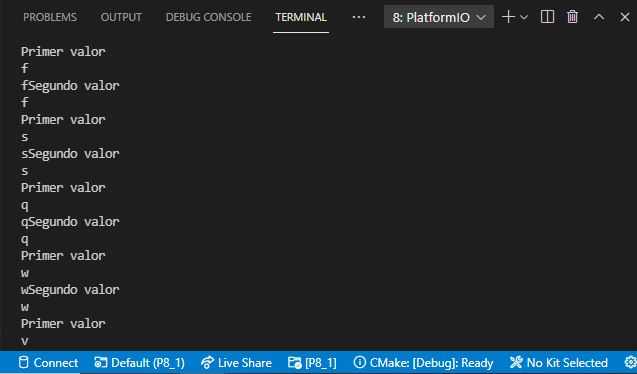
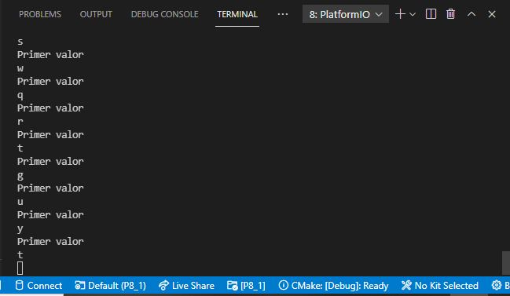

# PRACTICA 8_1  : Bucle de comunicacion uart2

## 1.Niveles de comunicación

* RS232: es una interaz que designa una norma para el intercambio de datos binarios serie entre un DTE ("Equipo Terminal de Datos"), como por ejemplo una computadora, y un DCE ("Equipo de Comunicación de Datos"), por ejemplo un módem.

* RS485: es un estándar de comunicaciones en bus de la capa física del Modelo OSI. Se usa con frecuencia en las UARTs para comunicaciones de datos de poca velocidad en las cabinas de los aviones. Por ejemplo, algunas unidades de control del pasajero lo utilizan, equipos de monitoreo de sistemas fotovoltaicos, etc.

* RS422: es una norma técnica para especificar las características eléctricas de un circuito de señal digital para la transmisión de datos serie. Algunos sistemas se interconectan directamente usando señales RS-422, o pueden utilizarse convertidores RS-422 para ampliar el rango de conexiones RS-232.

## 2.Funciones principales del software de arduino

* if(Serial): indica si el puerto serie especificado está listo.

```
void setup() {
  //Initialize serial and wait for port to open:
  Serial.begin(9600);
  while (!Serial) {
    ; // wait for serial port to connect. Needed for native USB
  }
}

void loop() {
  //proceed normally
}

```
* available(): obtiene el número de bytes (caracteres) disponibles para leer desde el puerto serie. Son datos que ya llegaron y se almacenaron en el búfer de recepción en serie (que contiene 64 bytes).

```
int incomingByte = 0; // for incoming serial data

void setup() {
  Serial.begin(9600); // opens serial port, sets data rate to 9600 bps
}

void loop() {
  // reply only when you receive data:
  if (Serial.available() > 0) {
    // read the incoming byte:
    incomingByte = Serial.read();

    // say what you got:
    Serial.print("I received: ");
    Serial.println(incomingByte, DEC);
  }
}

```
* availableForWrite(): obtiene el número de bytes (caracteres) disponibles para escribir en el búfer en serie sin bloquear la operación de escritura.

```
String myString = "Welcome to ArduinoGetStarted.com!\n";

void setup() {
  Serial.begin(9600); // opens serial port, sets data rate to 9600 bps
  int wlen = Serial.availableForWrite();
  // prints the received data
  Serial.print("TX buffer size: ");
  Serial.println(wlen);
}

void loop() {
  // check if Tx buffer is enough to write the string
  if (Serial.availableForWrite() > myString.length()) {
    // prints the string
    Serial.print(myString);
    delay(1000);
  }
}

```
* begin(): establece la velocidad de datos en bits por segundo (baudios) para la transmisión de datos en serie. Para comunicarse con la computadora, utilice una de estas tasas: 300, 600, 1200, 2400, 4800, 9600, 14400, 19200, 28800, 38400, 57600 o 115200.

```
void setup() {
    Serial.begin(9600); // opens serial port, sets data rate to 9600 bps
}

void loop() {}

```
* end(): desactiva la comunicación en serie, lo que permite que los pines RX y TX se utilicen para la entrada y salida general.

```
Serial.end();

```
* find(): lee datos del buffer serie hasta encontrar el string buscado.

```
Serial.find(caracter);
Serial.find(cadena);
Serial.find(buffer, lon);

```
* findUntil(): lee datos del buffer serie hasta que se encuentre una cadena de destino de una longitud dada o hasta la encontrar la terminación de la cadena.

```
Serial.findUntil(target, terminal);
Serial.findUntil(bufObj, lonObj, bufTer, lonTer);

```
* flush(): espera hasta la transmisión completa de los datos salientes.

```
Serial.flush();

```
* parseFloat(): devuelve el primer número de coma flotante válido del buffer serie.

```
Serial.parseFloat();

```
* parseInt(): busca el siguiente número int válido en la entrada serie.

```
Serial1.parseInt();
Serial2.parseInt(); 
Serial3.parseInt();

```
* peek(): devuelve el siguiente byte (carácter) de datos serie entrante sin sacarlo del buffer serie interno.

```
Serial1.peek(); 
Serial2.peek(); 
Serial3.peek();

```
* print(): imprime datos al puerto serie como texto ASCII legible por humanos

```
Serial.print(78) gives "78"
Serial.print(1.23456) gives "1.23"
Serial.print('N') gives "N"
Serial.print("Hello world.") gives "Hello world."

```
* println(): escribe datos en el puerto serial.

```

int data = 0;

void setup() {
  Serial.begin();
}

void loop() {
  data = analogRead(0);
  data = data / 4;
  // Imprime el valor almacenado en 
  // la variable data en el puerto serial
  Serial.println(data);  
}

```
* read(): lee los datos de la entrada serie.

```

int incomingByte = 0; // for incoming serial data

void setup() {
  Serial.begin(9600); // opens serial port, sets data rate to 9600 bps
}

void loop() {
  // send data only when you receive data:
  if (Serial.available() > 0) {
    // read the incoming byte:
    incomingByte = Serial.read();

    // say what you got:
    Serial.print("I received: ");
    Serial.println(incomingByte, DEC);
  }
}

```
* readBytes(): lee caracteres desde el búfer del puerto serie, hacia el especificado. La función termina si la longitud determinada se ha leído, o el tiempo de espera (ver Serial.setTimeout()) se ha agotado.

```
byte ref[2];
void setup(){
   Serial.begin(115200);
}
 
void loop(){
   if (Serial.available() > 2){
      Serial.readBytes(ref, 2);
      Serial.println(ref[0]);
      Serial.println(ref[1]);
   }
}

```
* readBytesUntil(): lee los caracteres del buffer serie en una matriz. La función termina si se detecta el carácter terminador, la longitud determinada ha sido leído, o el tiempo de espera se ha alcanzado (ver Serial.setTimeout()).

```

Serial.readBytesUntil(character, buffer, length);

```
* readString(): lee los caracteres del buffer serie en una cadena. La función se anula si el tiempo de espera se ha alcanzado (ver setTimeout()).

```

Serial.readString();

```
* readStringUntil(): lee los caracteres del buffer serie en una cadena. La función termina si se detecta el carácter terminador o el tiempo de espera se ha alcanzado (ver setTimeout()).

```

Serial.readStringUntil(terminator);

```
* setTimeout(): establece los milisegundos de espera máximos para datos serie utilizando Serial.readBytesUntil(), Serial.readBytes(), Serial.parseInt() o Serial.parseFloat(). Su valor predeterminado es 1000 milisegundos.

```

Serial.setTimeout();

```
* write(): escribe los datos binarios al puerto serie. Estos datos se envían como un byte o una serie de bytes.

```

void setup() {
  Serial.begin(9600);
}

void loop() {
  Serial.write(45); // send a byte with the value 45

  int bytesSent = Serial.write("hello");  //send the string "hello" and return the length of the string.
}

```
* serialEvent(): se llama cuando hay datos disponibles. Se utiliza para capturar estos datos.

```
void serialEvent1(){
//statements
}

void serialEvent2(){
//statements
}

void serialEvent3(){
//statements
}

```
## 3.Código fuente operativo

```

#include <Arduino.h>

char valor;
char valor2;

void setup() {

  Serial.begin(9600);
  Serial2.begin(9600);
  
}

void loop() {

  if(Serial.available()){

    valor = Serial.read();
    Serial2.write(valor);

    Serial.println("Primer valor");

    Serial.println(valor);

    delay(100);

    if(Serial2.available()){

      valor2 = Serial2.read();
      Serial.write(valor2);

      Serial.println("Segundo valor");

      Serial.println(valor2);

    }
    
  }
  
}

```

## 4.Explicación del código

Primero de todo definimos dos variables tipo char llamadas valor, que será el carácter que recibe el uart0 y, que posteriormente transmite el uart2, y el valor2 que recibe el uart2 y, que posteriormente transfiere el uart0.

En el setup, inicializamos el Serial para los uart0 y, el Serial2 para los uart2.

Finalmente, creamos el bucle de comunicación uart en el loop. Mediante sentencia condicional le decimos que, si el uart0 está disponible, lea el valor y que el uart2 lo transmita y se muestre por el terminal. Más tarde, si el uart2 está disponible, lea el valor2 y que el uart0 lo transmita y se muestre por el terminal. Así pues, se crea el bucle de comunicación uart2.

## 5.Salidas y entradas de consola

* Cable entre GPIO16 y GPIO17 conectado



* Cable entre GPIO16 y GPIO17 desconectado

